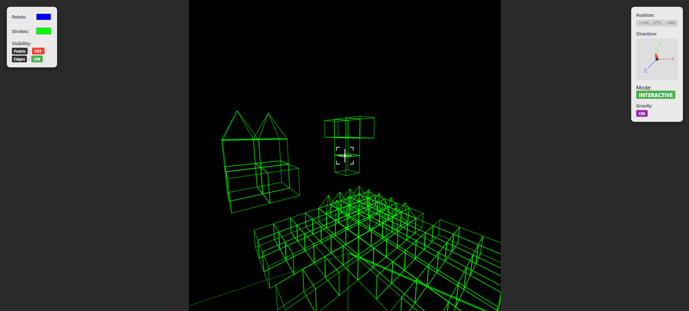

# WebBlocks

This is a little project which experiments with the rendering of and interaction with 3D structures in a web browser using HTML, CSS and JavaScript. The website is hosted using Python and Flask. It aims to include most basic features of Minecraft, such as a block-based environment, player characters which are able to navigate through this environment, and the ability to manipulate the environment through the placing and breaking of blocks.

## Showcase

## Features

- **Web Hosting**: Python and Flask server
- **3D Projection**: Structures projected to 2D plane without external libraries
- **Wireframe Structures**: Points connected by edges
- **World Grid**: 100-unit structure placement consistency
- **Custom Colors**: User-selectable rendering colors
- **6-DOF Camera**: Full position and rotation control
- **Keyboard Movement**: Arrow keys, space, and shift for translation
- **Keyboard Rotation**: WASD, Q, and E for camera rotation
- **Speed Control**: Alt modifier for increased movement and rotation speed
- **JSON Data Loading**: World positions and structure definitions from JSON files
- **Toggle Visibility**: M and N keys for points and edges display
- **Grid Snapping**: V key for camera and movement alignment to world grid
- **UI Information**: Position, rotation, mode, and visibility displays
- **Interactive Mode**: C key for first-person mouse-controlled camera
- **Crosshair Aiming**: Visual targeting aid in interactive mode
- **Structure Selection**: Number keys (1-9, 0) for building material selection
- **Raycast Removal**: Left-click to delete targeted structures
- **Raycast Placement**: Right-click to place structures on hit surfaces
- **Surface-Aware Placement**: Structures placed adjacent to specific hit faces
- **Collision Detection**: Prevents phasing through structures in interactive mode
- **Component Movement**: Independent collision blocking per movement axis
- **Gravity Toggle**: G key for downward force with ground detection
- **Mode Display**: Current camera mode with color coding (NORMAL/ALIGNED/INTERACTIVE)
- **Dynamic World Editing**: Real-time structure addition and removal
- **Optimized Storage**: Efficient world structure map with type caching
- More to come...

## Technical Architecture

- **Frontend**: Pure HTML5 Canvas with vanilla JavaScript
- **Backend**: Flask server serving static assets and JSON data
- **Rendering**: Custom 3D projection engine without external dependencies
- **Data Format**: JSON-based world and structure definitions

## Controls Reference

### Basic Movement

- **Arrow Keys**: Camera translation (forward/back/left/right/up/down)
- **Space**: Move upward
- **Shift**: Move downward

### Camera Rotation

- **WASD**: Pitch and yaw rotation
- **Q/E**: Roll rotation (when not in interactive mode)

### Interactive Mode

- **C**: Toggle first-person camera mode
- **Mouse**: Look around when pointer locked
- **Left Click**: Remove targeted structure
- **Right Click**: Place selected structure

### Special Functions

- **V**: Toggle aligned mode (grid snapping)
- **G**: Toggle gravity
- **M/N**: Toggle points/edges visibility
- **1-9, 0**: Select structure type for placement
- **Alt**: Speed multiplier (2x movement and rotation)
- **ESC**: Exit interactive mode

## Quick Start

1. Clone the repository
2. Create virtual environment: `python -m venv venv`
3. Activate: `venv\Scripts\activate` (Windows) or `source venv/bin/activate` (Unix)
4. Install dependencies: `pip install -r requirements.txt`
5. Run server: `python main.py`
6. Open browser: Navigate to `http://localhost:5000`
