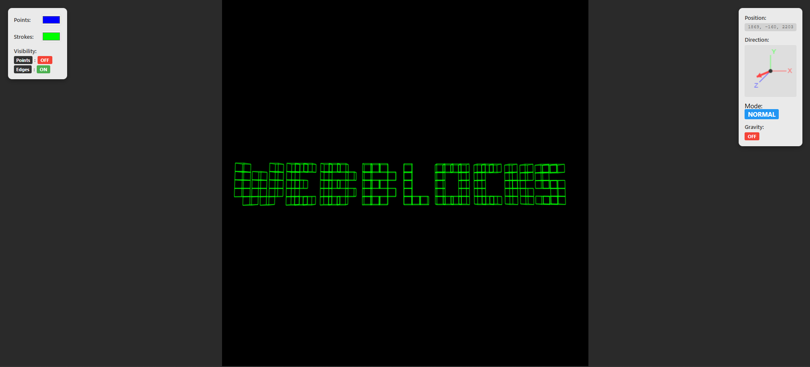
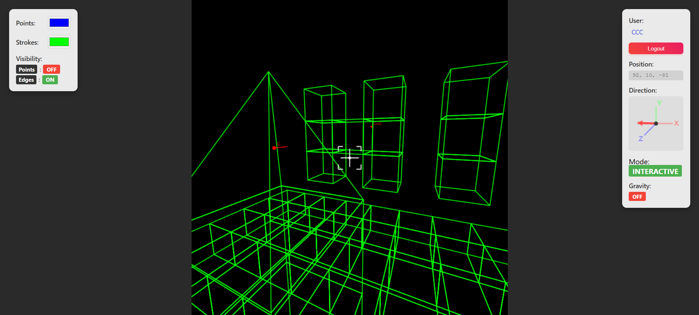

# WebBlocks

This is a little project which experiments with the rendering of and interaction with 3D structures in a web browser using HTML, CSS and JavaScript. The website is hosted using Python and Flask. It aims to include most basic features of Minecraft, such as a block-based environment, player characters which are able to navigate through this environment, and the ability to manipulate the environment through the placing and breaking of blocks.

## Showcase

## Features

- **Web Hosting**: Python and Flask server
- **3D Projection**: Structures projected to 2D plane without external libraries
- **Wireframe Structures**: Points connected by edges
- **World Grid**: 100-unit structure placement consistency
- **Custom Colors**: User-selectable rendering colors
- **6-DOF Camera**: Full position and rotation control
- **Keyboard Movement**: Arrow keys, space, and shift for translation
- **Keyboard Rotation**: WASD, Q, and E for camera rotation
- **Speed Control**: Alt modifier for increased movement and rotation speed
- **JSON Data Loading**: World positions and structure definitions from JSON files
- **Toggle Visibility**: M and N keys for points and edges display
- **Grid Snapping**: V key for camera and movement alignment to world grid
- **UI Information**: Position, rotation, mode, and visibility displays
- **Interactive Mode**: C key for first-person mouse-controlled camera
- **Crosshair Aiming**: Visual targeting aid in interactive mode
- **Structure Selection**: Number keys (1-9, 0) for building material selection
- **Raycast Removal**: Left-click to delete targeted structures
- **Raycast Placement**: Right-click to place structures on hit surfaces
- **Surface-Aware Placement**: Structures placed adjacent to specific hit faces
- **Collision Detection**: Prevents phasing through structures in interactive mode
- **Component Movement**: Independent collision blocking per movement axis
- **Gravity Toggle**: G key for downward force with ground detection
- **Mode Display**: Current camera mode with color coding (NORMAL/ALIGNED/INTERACTIVE)
- **Dynamic World Editing**: Real-time structure addition and removal
- **Multi-user Building**: Collaborative structure placement and editing
- **Optimized Storage**: Efficient world structure map with type caching
- **Server-Side Persistence**: World state automatically saved every 10 minutes
- **Shutdown Protection**: World data saved on server shutdown to prevent data loss
- **Memory Caching**: High-performance in-memory world state with periodic persistence

### Multiplayer Features

- **User Authentication**: Login system with session management
- **Real-time World State Sync**: Structures and user data (position, rotation) synchronized every 100ms
- **Player Rendering**: Other users shown as red dots with direction indicators
- **Distance Scaling**: Player indicators scale naturally with distance
- **Live Updates**: See other users move and interact in real-time

### User Features

- **Position Persistence**: User position and rotation saved on exit
- **Automatic Restore**: Return to previous location on login
- **User Data Reset**: R key to reset position, rotation, and modes
- **Session Management**: Secure user sessions with 24-hour lifetime

### Physics & Environment

- **Structure Collision**: Prevent movement through placed structures (Uses rectangular bounding boxes)
- **Toggle Controls**: G key to enable/disable gravity

### Visual Features

- **Customizable Colors**: Point and edge color pickers
- **Visibility Toggles**: Show/hide points and edges independently
- **Crosshair**: Interactive mode targeting display
- **Rotation Indicator**: Visual representation of viewing direction
- **Multi-user Indicators**: Distance-scaled player markers with usernames

## Technical Architecture

- **Frontend**: Pure HTML5 Canvas with vanilla JavaScript
- **Backend**: Flask server serving static assets and JSON data
- **Rendering**: Custom 3D projection engine without external dependencies
- **Data Format**: JSON-based world and structure definitions
- **Persistence**: APScheduler for periodic world saving and atexit for shutdown protection
- **Caching**: In-memory world state with JSON file persistence

## Controls Reference

### Basic Movement

- **Arrow Keys**: Camera translation (forward/back/left/right/up/down)
- **Space**: Move upward
- **Shift**: Move downward

### Camera Rotation

- **WASD**: Pitch and yaw rotation
- **Q/E**: Roll rotation (when not in interactive mode)

### Interactive Mode

- **Disables default movement and rotation**
- **C**: Toggle interactive mode
- **Mouse**: Pitch and yaw rotation
- **WASD**: Movement (forward/back/left/right)
- **Space/Shift**: Movement (up/down)
- **Left Click**: Remove targeted structure
- **Right Click**: Place selected structure

### Special Functions

- **V**: Hold for aligned mode (grid snapping)
- **G**: Toggle gravity
- **R**: Reset user data (position, rotation, and modes)
- **M/N**: Toggle points/edges visibility
- **1-9, 0**: Select structure type for placement
- **Alt**: Speed multiplier (2x movement and rotation)
- **ESC**: Exit interactive mode

## Quick Start

1. Clone the repository
2. Create virtual environment: `python -m venv venv`
3. Activate: `venv\Scripts\activate` (Windows) or `source venv/bin/activate` (Unix)
4. Install dependencies: `pip install -r requirements.txt`
5. Run server: `python main.py`
6. Open browser: Navigate to `http://localhost:5000`
